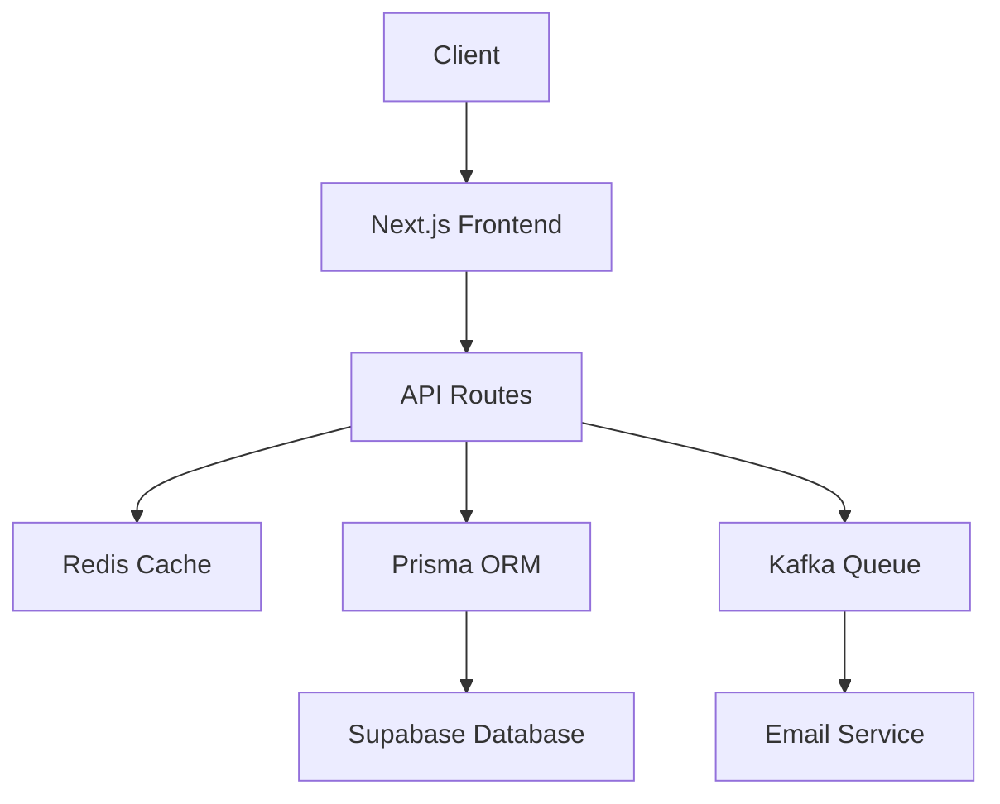

# URL Manager

<div align="center">

[](https://mjkm.vercel.app)
[](https://opensource.org/licenses/MIT)
[](https://nextjs.org/)
[](https://supabase.com)

</div>

A powerful URL management system built with modern technologies, offering advanced features beyond traditional URL shortening services. This project combines robust architecture with high performance to deliver a seamless URL management experience.

## ✨ Features

### Core Functionality
- **URL Shortening**: Transform long URLs into concise, shareable links
- **Smart Redirection**: Lightning-fast redirection to original URLs
- **User Management**: Secure authentication and personalized URL management
- **Analytics Dashboard**: Track and analyze URL performance metrics
- **Enterprise-Grade Security**: Industry-standard security practices

### Technical Highlights
- **High Performance**
  - Redis caching for frequently accessed URLs
  - Kafka message queue for asynchronous operations
  - Optimized database queries with Prisma
- **Robust Architecture**
  - Server-side rendering with Next.js
  - Real-time analytics processing
  - Rate limiting and request throttling
- **Modern Stack**
  - Next.js for frontend and API routes
  - Prisma ORM for database operations
  - Supabase for backend infrastructure
  - NextAuth for authentication
  - Tailwind CSS for styling

## 🚀 Getting Started

### Quick Demo
Try out the application instantly using these credentials:
```
Email: jamikhan8439@gmail.com
Password: 12341234
```

### Installation

1. Clone the repository
```bash
git clone https://github.com/mohdjami/url-manager.git
cd url-manager
```

2. Install dependencies
```bash
npm install
```

3. Set up environment variables
```bash
cp .env.example .env.local
```

4. Start the development server
```bash
npm run dev
```

## 🛠 Architecture



## 📈 Performance

- **Response Time**: <100ms for cached URLs
- **Availability**: 99.9% uptime
- **Scalability**: Handles millions of requests/day

## 🔒 Security Features

- JWT-based authentication
- Rate limiting
- SQL injection protection
- XSS prevention
- CSRF protection
- Input sanitization

## 📊 Analytics

Track important metrics for your URLs:
- Click-through rates
- Geographic distribution
- Device statistics
- Time-based analytics
- Referrer tracking

## 🔄 API Documentation

### Base URL
```
https://mjkm.vercel.app/api
```

### Endpoints

| Method | Endpoint | Description |
|--------|----------|-------------|
| POST   | /api/v2/urls/create-url | Create short URL |
| GET    | up/:slug   | Redirect to original URL |
| GET    | /stats/:code | Get URL statistics |
| DELETE | /url/:id | Delete URL |

## 🛣 Roadmap

- [ ] Custom domain support
- [ ] Advanced analytics dashboard
- [ ] API rate limiting dashboard
- [ ] Team collaboration features
- [ ] Bulk URL management
- [ ] Enhanced security features

## 🤝 Contributing

We welcome contributions! Please see our [Contributing Guidelines](CONTRIBUTING.md) for details.

1. Fork the repository
2. Create your feature branch (`git checkout -b feature/AmazingFeature`)
3. Commit your changes (`git commit -m 'Add some AmazingFeature'`)
4. Push to the branch (`git push origin feature/AmazingFeature`)
5. Open a Pull Request

## 🙏 Acknowledgments

- [Next.js](https://nextjs.org/)
- [Prisma](https://www.prisma.io/)
- [Supabase](https://supabase.com/)
- [Kafka](https://kafka.apache.org/)
- [Redis](https://redis.io/)
- [NextAuth](https://next-auth.js.org/)
- [Tailwind CSS](https://tailwindcss.com/)

## 📧 Contact

Jami Khan - [@mohdjami786](https://twitter.com/mohdjami786)

Project Link: [https://github.com/mohdjami/url-manager](https://github.com/yourusername/url-manager)

---
<div align="center">
Made with ❤️ by Mohd Jami
</div>
